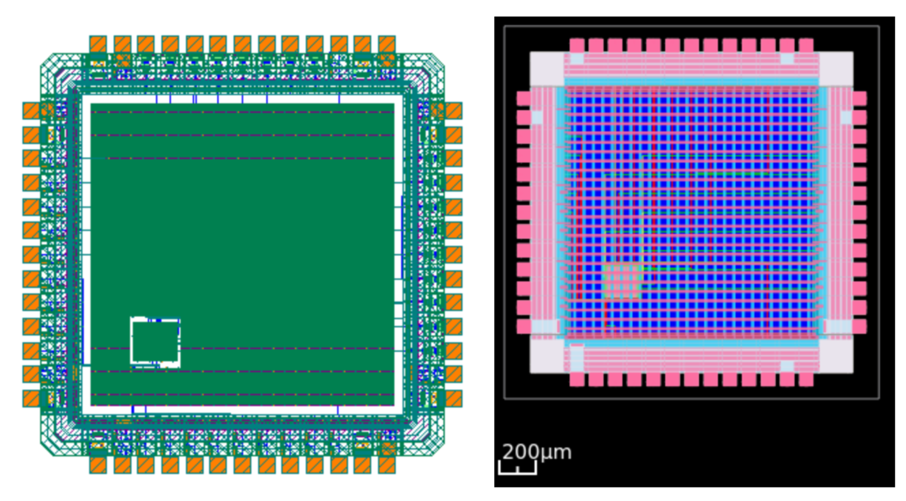

# UNIC-CASS Mock Tapeout Project  
## Integrated Temperature-Controlled Desorption Driver – 3C-CO₂  
### Digital Design Team Repository

[Librelane Digital Flow (UNIC-CASS)](https://github.com/unic-cass/unic-cass-wrapper/actions/workflows/digital-flow.yaml)

---

## 1. Project Overview

This repository contains the digital design and chip-level integration of a **low-power PWM controller** intended to regulate the thermal desorption stage of a **fixed-bed CO₂ capture system** (3C-CO₂ project).

The work was developed as part of the **UNIC-CASS Mock Tapeout** and demonstrates:

- Digital RTL design  
- Macro hardening using LibreLane  
- Integration into the UNIC-CASS chip wrapper  
- Execution of a complete chip-level digital flow using open-source tools  

The objective of this repository is to document the **process and results** of the mock tapeout rather than to deliver a fabrication-ready integrated circuit.

---

## 2. System Context

The overall system corresponds to a **temperature-controlled desorption driver**.  
The digital controller operates after the sensing and analog-to-digital conversion stages, which are assumed to be external to this work.

**System chain:**

```
Temperature Sensor → ADC → Digital PWM Controller → Heater Driver
```
The PWM output modulates the power delivered to a heating element used during the CO₂ desorption phase.

---

## 3. Digital Temperature Regulation System

The digital core implements a **simple PWM-based control strategy**, designed for low complexity, low power consumption, and straightforward physical integration.

### 3.1 Functional Description

**Inputs (from UNIC-CASS wrapper):**
- `clk_i` — Clock signal  
- `rst_ni` — Active-low reset  
- `ui_PAD2CORE[16:0]` — Input bus  
  - `ui_PAD2CORE[1:0]` → Reference temperature (`ref_bits`)  
  - `ui_PAD2CORE[3:2]` → Measured temperature (`state_bits`)  

**Output:**
- `uo_CORE2PAD[0]` — PWM control signal  

**Internal signals:**
- `counter` — 2-bit PWM counter (PWM period = 4 cycles)  
- `effective_duty` — Duty cycle computed from reference versus measured state  

---

## 4. Repository Structure

Key directories in this repository are organized as follows:

```
├── unic_cass_wrapper_user_project/
│   └── pwm_desorption/
│       ├── src/
│       │   ├── pwm1.v
│       │   └── user_project_example.v
│       ├── config.json
│       └── final/              # Generated locally (gitignored)
│
├── unic_cass_wrapper/
│   ├── src/
│   │   └── user_project_wrapper.sv
│   ├── config.json
│   └── final/                  # Generated locally (gitignored)
│
├── IHP-Open-PDK/
├── librelane/
├── Makefile
└── README.md

```
> **Note:** All `final/` directories are generated locally and excluded from version control according to the provided `.gitignore`.

---

## 5. Environment Setup

The project is intended to be executed inside the **UNIC-CASS Docker container**.

After cloning the repository:

```bash
git clone https://github.com/TheWeenhayek/unic-cass-wrapper.git
cd unic-cass-wrapper
```
Initialize required submodules:
```
make setup
```
This step fetches LibreLane, the IHP open-source PDK, and the UNIC-CASS wrapper dependencies.

---
## 6. Macro Hardening (PWM Controller)

The PWM controller is hardened using LibreLane within the UNIC-CASS user project environment.

Navigate to the user project directory:
```
cd unic_cass_wrapper_user_project
```
Run the hardening flow:
```
make pwm_desorption
```
This process generates the hardened macro artifacts locally, including GDS, LEF, timing libraries, parasitic extraction files, and reports.

To inspect the hardened macro layout:
```
make pwm_desorption VIEW_RESULTS=1
```

---
## 7. Wrapper Integration and Chip-Level Flow

After macro hardening, the design is integrated into the UNIC-CASS wrapper.

Navigate to the wrapper directory:
```
cd ../unic_cass_wrapper
```
Execute the chip-level flow:
```
make
```
This step performs floorplanning, pad ring integration, power distribution network generation, macro placement, routing, and manufacturability checks.
The flow completes up to the Report Manufacturability stage.

---
## 8. Layout Visualization

All generated layouts were inspected using KLayout.

Example commands:
```
klayout final/gds/user_project_wrapper.gds
klayout unic_cass_wrapper_user_project/pwm_desorption/final/gds/user_project_example.gds
```
For clarity in visualization:
- Internal routing layers are used when inspecting the hardened macro
- Top metal and pad ring layers are emphasized when inspecting the final mock tapeout layout

⸻

## 9. Final Remarks

The mock tapeout process required careful alignment between the hardened digital macro and the UNIC-CASS wrapper integration flow. Through iterative execution and validation, the design was successfully taken from RTL to a chip-level layout using the LibreLane/OpenROAD open-source toolchain, demonstrating a complete and functional digital implementation flow within the UNIC-CASS framework.

---

## 10. Annexes

This section includes additional visual material generated during the mock tapeout process. These figures are provided for reference and to support the verification of macro hardening and chip-level integration.

### Annex A – Hardened Macro Layout

This figure shows the **hardened PWM macro** generated using the LibreLane flow.  
The layout highlights internal routing and pin placement used for integration into the UNIC-CASS wrapper.


---

### Annex B – Final Mock Tapeout Layout

This figure presents the **final chip-level mock tapeout layout**, including the pad ring, global power distribution network, and the integrated digital macro placed within the core area.



---